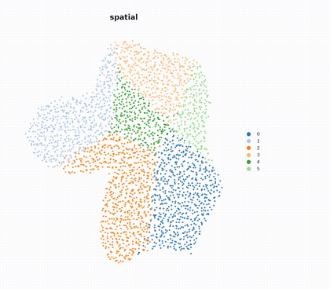

# embedmorph

[](https://embedmorph.readthedocs.io)
[](LICENSE)
[](pyproject.toml)



Morph a spatial transcriptomics scatter plot into its UMAP embedding, colored
by an `.obs` column (cell type, niche, cluster...), and render it as an mp4.
 

The same machinery works for any pair of AnnData `.obsm` embeddings, not
just spatial → UMAP -- PCA → UMAP, t-SNE → UMAP, before/after batch
correction, etc. are all fully supported (just pass different `obsm_from`/
`obsm_to` keys), spatial → UMAP just happens to be the case this package was
built around.

## Install

```bash
pip install -e .
# or, for the tqdm progress bar during rendering:
pip install -e ".[progress]"
```

Requires `ffmpeg` to be available to `imageio-ffmpeg` (it bundles its own
static binary by default, so this normally works out of the box even on a
compute node with no system ffmpeg module).

## Usage

### As a library

```python
from embedmorph import make_transition_video

make_transition_video(
    adata,
    obsm_from="spatial",
    obsm_to="X_umap",
    color="cell_type",
    out_path="transition.mp4",
)
```

(Any other `.obsm` pair -- `obsm_from="X_pca"`, etc. -- works exactly the
same way.) See `docs/demonstrations/01_quickstart.ipynb` for a runnable
end-to-end example (synthetic spatial data, plus a snippet for real data via
`scanpy`), and `docs/demonstrations/02_gallery.ipynb` for palettes,
highlighting, point outlines, and the flowing-arcs/staggered-launch
flourish.

### From the command line

```bash
embedmorph my_spatial_data.h5ad \
  --obsm-from spatial --obsm-to X_umap \
  --color cell_type \
  -o transition.mp4
```

Run `embedmorph --help` for all options (frame count, fps, point size,
figure size/dpi, easing, legend, colors, hold duration, etc).

A few worth calling out:

```bash
# Journal-style palette
embedmorph my_data.h5ad --obsm-from spatial --obsm-to X_umap \
  --color cell_type -o transition.mp4 --palette Nature

# Spotlight one or two cell types against a greyed-out atlas
embedmorph my_data.h5ad --obsm-from spatial --obsm-to X_umap \
  --color cell_type -o transition.mp4 \
  --highlight "CD8 T cells" "Tregs" --highlight-size-boost 2.5

# Organic flock motion instead of plain straight-line/synchronized travel
embedmorph my_data.h5ad --obsm-from spatial --obsm-to X_umap \
  --color cell_type -o transition.mp4 \
  --arc-strength 0.15 --stagger 0.3

# scanpy-style point outlines (costs ~3x the per-frame render time --
# best for smaller cell counts or a subsample, gets muddy on dense atlases)
embedmorph my_data.h5ad --obsm-from spatial --obsm-to X_umap \
  --color cell_type -o transition.mp4 --add-outline
```

### On a compute cluster

Rendering is single-process (no GPU needed); the main memory driver is the
number of cells the backed AnnData holds in `.obs`/`.obsm`, not `.X` --
`embedmorph` never touches `.X`, so the CLI reads the file in backed mode by
default. For anything past a few thousand cells, render on a compute node
rather than interactively; if you're rendering many datasets, submit one job
per video rather than looping inside one job.

## Documentation

Full docs (API reference + demo notebooks) are at
https://embedmorph.readthedocs.io, source in [`docs/`](docs/). To build
locally:

```bash
pip install -e ".[docs]"
sphinx-build -b html docs docs/_build/html
```

## Notes / tradeoffs

- Currently uses the first two dimensions of each `.obsm` array (configurable
  via `--dims`); this is a 2D scatter transition, not a 3D one.
- `align=True` (default) is recommended whenever the two embeddings aren't
  already in a comparable orientation/scale -- which is the common case
  whenever a UMAP is on one side, whether the other side is spatial
  coordinates or PCA/t-SNE. Turn it off (`--no-align`) if you specifically
  want to see the raw, unaligned coordinate difference.
- Legends are only drawn for categorical colors with <=60 categories (more
  than that stops being readable in a corner legend). The default palette
  chains `tab20`+`tab20b`+`tab20c` (60 distinct colors) before it starts
  repeating.

## License

MIT -- see [LICENSE](LICENSE).
